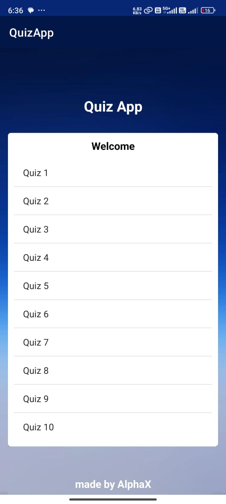

# Quiz App


The Quiz App is designed to present multiple-choice questions to users, providing immediate feedback on their answers. This app features an intuitive interface and includes all the functionalities needed for an engaging quiz experience.

## Table of Contents

- [Features](#features)
- [Screenshots](#screenshots)
- [Installation](#installation)
- [Usage](#usage)
- [Contributing](#contributing)
- [Contact](#contact)
- [Demo](#demo)

## Features

- **Home Screen**: List of available quizzes or start a new quiz.
- **Quiz Selection**: Choose a quiz from the list or start a random quiz.
- **Quiz Questions**: Present one question at a time with multiple-choice options.
- **Answer Submission**: Select an option and submit the answer.
- **Score Calculation**: Track the user's score based on correct answers.
- **Result Screen**: Show the final score and correct/incorrect answers.
- **User Interface**: User-friendly and visually appealing design.

## Screenshots

<div>
    
    
    
</div>

## Installation

### Prerequisites

- Android Studio installed on your machine
- A device or emulator to run the app

### Steps

1. Clone the repository:
    ```bash
    git clone https://github.com/nihalahmed07/CodSoft-Task-4-QuizApp.git
    ```
2. Open the project in Android Studio.
3. Let Android Studio install any required dependencies.
4. Build and run the app on your device or emulator.

## Usage

1. Open the app to view the list of available quizzes or start a new quiz.
2. Choose a quiz from the list or start a random quiz.
3. Answer each question by selecting an option and submitting your answer.
4. View immediate feedback for each question.
5. After completing the quiz, view your final score and see which answers were correct or incorrect.

## Contributing

Contributions are welcome! If you'd like to contribute, please fork the repository and use a feature branch. Pull requests are warmly welcomed.

1. Fork the repository.
2. Create a new branch:
    ```bash
    git checkout -b feature/YourFeature
    ```
3. Make your changes.
4. Commit your changes:
    ```bash
    git commit -m 'Add some feature'
    ```
5. Push to the branch:
    ```bash
    git push origin feature/YourFeature
    ```
6. Create a new pull request.

## Contact

Nihal Ahmed - [n.nihalahmed1@gmail.com](mailto:n.nihalahmed1@gmail.com)

Project Link: [QuizApp](https://github.com/nihalahmed07/CodSoft-Task-4-QuizApp.git)

## Demo

Check out a video demo of the Quiz App on YouTube: [Click here for demo](https://youtu.be/mZqgDroGMEg)
